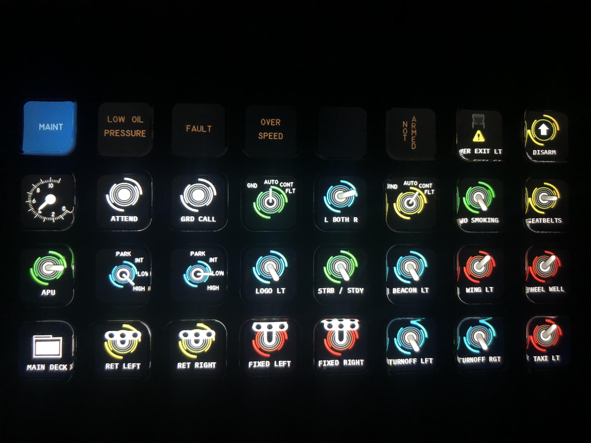

# X-Plane Stream Deck Manager

This is a manager for X-Plane <-> Elgato Stream Deck connection. Developed on Python 3.10 for X-Plane 11.51.

This software includes rich set of features for robust control of the simulator cockpit.

Developed with the idea taking away mouse controlling of most of the cockpit, 
works best together with other simulator peripherals (e.g. radio, A/P panel etc.)

**Currently supporting**:
- Stream Deck Mini
- Stream Deck MK1 (MK2 should work too)
- Stream Deck XL (tested)

### Features:
- Directories
- Toggle actions (single command)
- Multiple command actions
- Momentary switches
- Push/Release actions
- Supporting multi-position switches (e.g. ENGINE START / IGNITION on 737) 
control via single button
- On-Off actions
- Sync with X-Plane's dataref to visually depict the actual state
- Multiple dataref states with each custom key image
- Custom Labels
- ***Gauges***
- ***400+ custom made icons*** 

All of these features can be configurated in simple YAML configs. YAML is very easy to use
and simple format similar to JSON, but more human-readable and harder to cause a syntax error in.

**Refer to the `B737-800X/README.md` for a guide on how to create/edit buttons.**

*More example images in `misc/`*

#### Notes
A lot of buttons in the flight deck are momentary switches and buttons, which are expected to be held in position.
For that purpose, I have built a small LUA file with custom commands in `misc/streamdeck_handlers.lua`.
The momentary switches work on a way that the `command_begin` executes the `begin` part of the command, 
which switches it into the desired position, and `command_end` which returns the switch/button back into its 
stable position (also known as the `end` part of the command`. 

So, the bad news is that you have to create two commands for your each `begin` and `end` action everytime.

The X-Plane UDP protocol is limited in this way, the UDP protocol is able to execute only all 3 parts of the
command (yes, 3.. begin, continue, end), so I recommend solving it this way. You will map those two commands 
from the LUA handler in the`command` and `command-release` YAML configuration. 
Look for examples in `actions.yaml`, where it is used on fire warning or master caution of the 737 etc.
### How it works
The streamdeck Python library provides modular access. 

X-Plane has its simple, yet powerful UDP protocol for
communication with the external applications.

You define your yaml configurations and icons.

The software then efficiently runs in background updating your buttons and responding to state changes of the buttons.

### Key Creation and Configuration
1. Create empty directory with any name (ex. B737), that name will need to be referenced in config.yaml. 
Your actions.yaml and other keysets (directories) will take place here.
Actual icons as files are going to be put under 'icons' directory.
2. The actions.yaml resembles the root directory of the stream deck keys.
3. xyz.yaml, ABC.yaml, 123.yaml... *.yaml resembles the keysets (directories),
you're going to reference the directories by their name in key configs with keys attributed as "dir".
4. Keyset can be left unreferenced, it will be simply ignored and NOT loaded into memory.

I still strongly recommend checking the examples and work your way from there, they are based on 737 Zibo.

### What is planned / WIP?
- Dynamic dataref display types
- More types of labels
- Multi deck support

## Dependencies
- NumPy
- PyYAML
- streamdeck - Windows requires additional DLL's installed in its root Python executable directory
- Pillow
- pyxpudpserver

## Known Issues
There is currently a bug in **pyxpudpserver** that causes the dataref updating of buttons to
freeze (giving you a message *"dictionary changed size during iteration"*.

The proposed solution is to use locking instead of simple if condition in its main lib file.

## License
BSD 2-Clause License

Copyright (c) 2022, Daniel Slavík All rights reserved.

www.wortelus.eu
