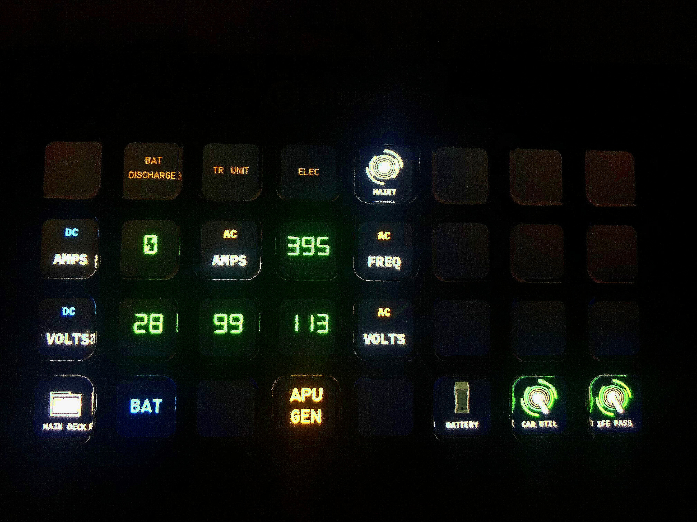
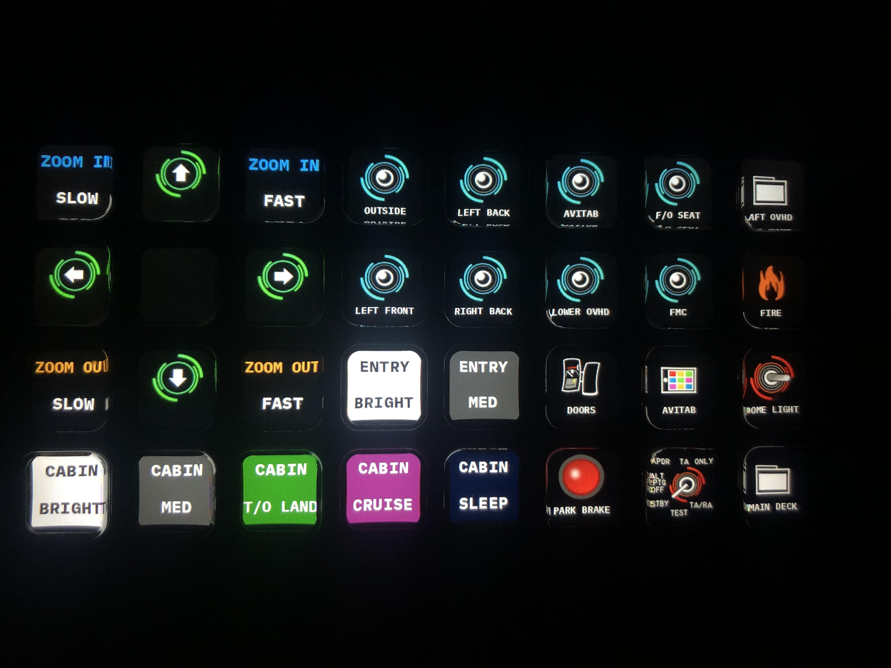

# X-Plane Stream Deck Manager


This is a manager for X-Plane <-> Elgato Stream Deck connection. Developed in Python 3.10 for X-Plane 11 & **X-Plane 12**.

This software includes rich set of features for robust control of the simulator cockpit.

Developed with the idea taking away mouse controlling of most of the cockpit, 
works the best together with other simulator peripherals (e.g. radio, A/P panel etc.)

**Supported simulator platforms:**
- X-Plane 11
- X-Plane 12

**Supported planes:**

| Aircraft       | 15 keys | 32 keys |
|----------------|---------|---------|
| Cessna 172SP   | ❌       | ✅✅      |
| Zibo 737-800   | ✅       | ✅✅      |
| JARDesign A320 | ✅       | ❌       |

✅✅ - Stable configuration, expecting minor fixes only

✅ - Working configuration, further work expected

Configurations are made by **community efforts** or **people like you**, who would like to provide handful
useful buttons for the flight sim community.

The configurations marked with green mark are bundled and ready to use with *xplane-streamdeck*.

### Features:
- Fast & high performance sync with X-Plane's dataref to visually depict the actual state
- Multiple dataref states with each custom key image
- Directories
- Toggle actions (single command)
- Multiple command actions
- Momentary switches
- Push / Release actions
- Supporting multi-position switches or knobs control via single button (cycling positions)
- Custom, configurable labels
- **Displays**
- **Gauges**
- **500+ custom-made icons** for the 737 NG, A320, Cessna 172 and more

All of these features can be configured in simple YAML configs. YAML is very easy to use
and simple format similar to JSON, but more human-readable and harder to cause a syntax error in.

### Dependencies
- NumPy
- PyYAML
- streamdeck - Windows requires additional DLL's installed in directory under %PATH% variable (LibUSB HIDAPI)
- Pillow
- pyxpudpserver

## Installation
**Recommended installation** is by using precompiled **win64-exe** release for Windows.

Instructions for building the executable are in the [build-windows.md](docs/build_windows.md) file.

You can also install the script manually by following the instructions below.

### Windows Installation

Instructions for **Windows**

1. **Download and install Python 3 (3.10 minimum recommended)**

- *choosing the option to add Python to %PATH% and removing the %PATH% length limit is **recommended***
- both are options during installation, otherwise you might have to include absolute path to Python to launch the script

2. **Clone this repository by:**
- download the latest stable release under the **Releases** section
- or clone by git on your machine by `git clone https://github.com/wortelus/xplane-streamdeck.git`
- or download source code by **Download ZIP** and extract the files
3. **Install the dependencies / requirements by**

`python -m pip install -r requirements.txt`

using cmd or PowerShell

4. **Install LibUSB HIDAPI**

- The *streamdeck* package requires LibUSB HIDAPI, install it by following this 
[guide](https://python-elgato-streamdeck.readthedocs.io/en/stable/pages/backend_libusb_hidapi.html)
from the official documentation source

5. **Add the streamdeck handlers to `X-Plane 11\Resources\plugins\FlyWithLua\Scripts`**
- Ensure you have **FlyWithLua** installed
- Copy the streamdeck_handler_*[plane code]*.lua files from the `misc/` directory into the `FlyWithLua\Scripts`

## Usage
Instructions for **Windows**

Choose desired plane type configuration in `config.yaml` by setting the `active-preset` parameter

### Win64 Executable
- Download the latest release from the **Releases** section
- Extract the files
- Run the `xplane-streamdeck.exe` file
- The program will automatically detect the Stream Deck and start the communication with X-Plane
- For easier access, you can create a shortcut to the executable and place it on your desktop


### CLI Usage
**Execute the script by running the `start.py` with Python 3 by:**

running `python .\start.py` under the *xplane-streamdeck* directory, 
while having the Stream Deck plugged in already

Run the script anytime after the aircraft loads in the simulator, the script can be restarted anytime without harm.


### Configuration
If you use multiple Stream Decks, you can specify the device by setting the serial number in the `secret.yaml` file.
If you use only one Stream Deck, the script will automatically detect it.

The program supports image caching, which saves several seconds of image preloading during launch
- To enable it, set `caching-enabled` field to *True* in local `config.yaml`, for example in `172SP/config.yaml`
- To disable, just remove the field or leave it blank
- NOTE: If you are tweaking your image set or configuration, it is recommended disable this feature 
to always see the up-to-date configuration state (or simply remove it, but the cache will be recreated).
- **Old cache with new icon set, configuration, font etc. can often cause funky behavior or crashes.**

## Additional Info
|        Lower Overhead 737 NG        |   MCP Collins 737 NG   |
|:-----------------------------------:|:----------------------:|
|  |    |
|   **Electrical Overhead 737 NG**    |   **Miscellaneous**    |
|     |  |

*More example images in `misc/`*

### Key Creation and Configuration
**Refer to the `docs/plane_keys_configuration.md` for a guide on how to create/edit buttons.**

### What is planned / WIP?
- Backward compatible GUI Drag 'n Drop utility for managing the plane presets

### Known Issues
- There was a bug in **pyxpudpserver** that sometimes caused the dataref updating of buttons to
freeze, giving you a message:
`
RuntimeError: dictionary changed size during iteration
`

    The following proposed solution [has been merged](https://github.com/leleopard/pyXPUDPServer/pull/5) in version 1.2.8 of **pyxpudpserver**. If you get this error, update or reinstall your dependencies via *pip* instead of using the following [forked version with temporary fix](https://github.com/wortelus/pyXPUDPServer).

- There is a known risk of crashes associated with running Stream Deck through USB hubs:
```
    raise TransportError("Failed to write out report (%d)" % result)
StreamDeck.Transport.Transport.TransportError: Failed to write out report (-1) 
```

- If you break the config socket (IP address / port) settings or launch the xplane-streamdeck twice, you will get
this message.
```
The X-Plane UDP connection could not be initialized due to operating system error, this is probably caused by misconfiguration of port numbers or the xplane-streamdeck is launched twice.
```
### Acknowledgments
*IBMPlexMono* & *DSEG* 
- Licensed under the SIL Open Font License 1.1.

This project uses the following third-party libraries:
- HIDAPI, licensed under BSD 2-Clause License. See [LICENSE-hidapi-bsd.md](misc/LICENSE-bsd-hidapi.md) for more details.

### Contributors
I would like to thank the following members of the flight sim community for participating in this open source project.
 - **esmiol** from *x-plane.org* forums - for creating the Cessna 172 configuration and graphics
 - **jpx13009** from *x-plane.org* forums - for creating the JARDesign A320 configuration and graphics 
along with restructuring the Zibo 737-800 plane preset into the 15 key Stream Deck variant
## License
BSD 2-Clause License

Copyright (c) 2022, Daniel Slavík All rights reserved.

www.wortelus.eu
